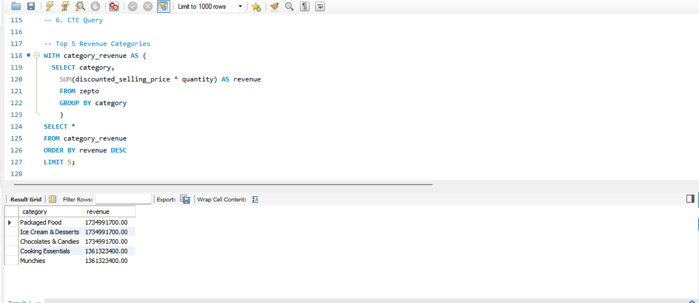
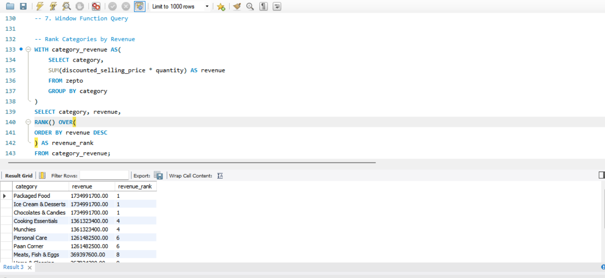
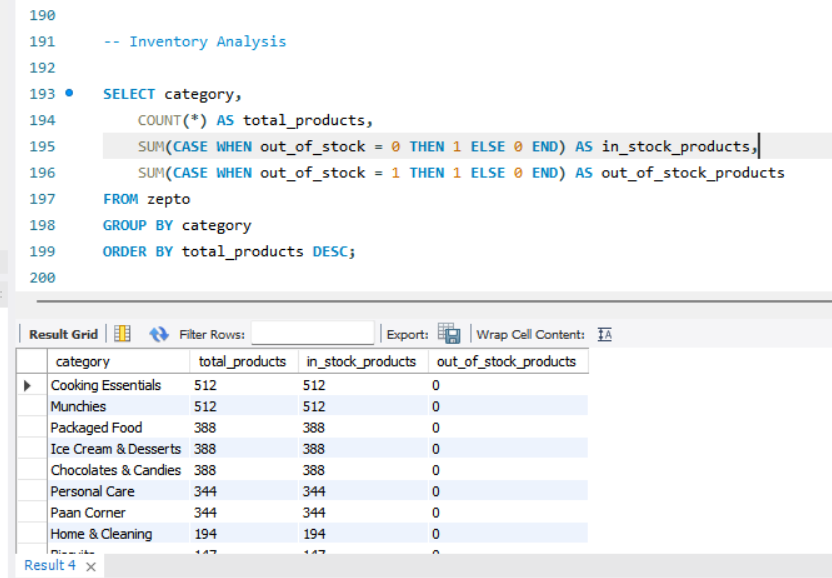

# 🛒 Zepto Sales & Inventory Analytics (SQL)

## About the Project

This project focuses on analyzing Zepto's inventory dataset using SQL to uncover insights related to product pricing, discounts, stock availability, inventory health, and revenue opportunities.

Using a dataset containing 3,700+ products sourced from Kaggle, I performed exploratory data analysis and business-focused analytics to identify high-performing categories and products, evaluate discount effectiveness, and generate insights that can support inventory optimization and revenue growth.

---

## Dataset

**Source:** Kaggle – Zepto Inventory Dataset

The dataset contains product-level information including:

* Product Name
* Category
* MRP
* Discounted Selling Price
* Discount Percentage
* Available Quantity
* Product Weight
* Stock Status

---

## Project Objectives

* Analyze product pricing and discount strategies
* Evaluate inventory health and stock availability
* Identify top revenue-generating categories and products
* Calculate category-wise revenue contribution
* Measure discount impact on product performance
* Generate insights for inventory optimization and revenue growth

---

## SQL Concepts Used

* Aggregate Functions
* GROUP BY & HAVING
* CASE Statements
* Subqueries
* Common Table Expressions (CTEs)
* Window Functions
* Ranking Functions
* Conditional Aggregations

---

## Analysis Performed

### Data Exploration

* Explored product distribution across categories
* Analyzed stock availability patterns
* Examined pricing and discount trends
* Identified duplicate products across different SKUs

### Business Analysis

* Identified top revenue-generating categories
* Ranked products based on revenue potential
* Calculated category-wise revenue contribution
* Evaluated discount effectiveness across categories
* Analyzed inventory availability and stock status
* Compared product performance within categories

---

## Key Insights

* A small number of categories contribute a significant share of overall revenue potential.
* High discounts do not always correspond to higher revenue opportunities.
* Several categories show inventory gaps due to out-of-stock products.
* Product-level analysis helped identify high-performing and underperforming products.
* Pricing and inventory insights can support better stocking and revenue decisions.

---

## Sample Analysis Outputs

### Top Revenue Categories

### Revenue Contribution Analysis

### Inventory Analysis

---

## Tools Used

* MySQL
* MySQL Workbench

---

## Repository Structure

📁 Dataset

📁 SQL Queries

📁 Insights

📄 README.md

---

## Author

**Naman Tripathi**
B.Tech, Materials & Metallurgical Engineering
MANIT Bhopal
